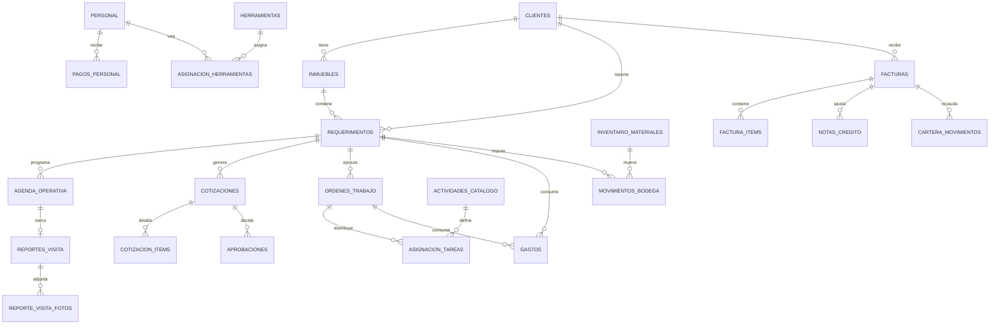

# Creixer Manager - Arquitectura Integral del Sistema

## 1) Arquitectura completa del sistema

## 1.1 Dominio y capas

- **Frontend/BFF**: Next.js (App Router + Server Actions + Route Handlers).
- **Datos y seguridad**: Supabase Postgres + RLS + Auth.
- **Evidencias/archivos**: Supabase Storage.
- **Analítica**: vistas materializadas / vistas SQL para KPIs.

Capas lógicas:

1. **Presentación**: pantallas por módulo, filtros, tableros.
2. **Aplicación**: casos de uso (crear requerimiento, agendar, reportar, cotizar, facturar, etc.).
3. **Dominio**: reglas de negocio y máquinas de estados.
4. **Infraestructura**: repositorios Supabase, storage, notificaciones.
5. **Analítica**: KPIs, alertas de proceso, rentabilidad.

## 1.2 Módulos funcionales (macro)

1. Gestión comercial y operativa: clientes, inmuebles, requerimientos, agenda, reporte, órdenes.
2. Configuración de trabajo: catálogo de actividades/servicios.
3. Gestión de personas: personal, asignación de tareas, pagos al personal.
4. Control financiero: gastos, facturación, notas crédito, cartera.
5. Control de activos: bodega inventario, herramientas, asignaciones.
6. Inteligencia operativa: reportes, indicadores, dashboard gerencial.

## 1.3 Principios de diseño

- Todo movimiento relevante se registra con `created_at`, `updated_at`, `created_by`.
- El **requerimiento/caso** es el eje transversal de trazabilidad y rentabilidad.
- Separar:
  - costo de mano de obra,
  - costo de materiales,
  - gastos indirectos,
  - ingreso facturado/cobrado.
- Estados controlados por transiciones explícitas (triggers + validaciones de aplicación).

## 2) Modelo de datos y relaciones

## 2.1 Núcleo maestro

- `profiles` (usuarios internos/externos con rol)
- `clientes`
- `inmuebles` (FK `cliente_id`)
- `personal` (extensión operativa de `profiles`)
- `actividades_catalogo` (servicios, mano de obra, precios de referencia)

## 2.2 Flujo operativo principal

- `requerimientos`
  - FK: `cliente_id`, `inmueble_id`
- `agenda_operativa`
  - FK: `requerimiento_id`, `tecnico_id`
- `reportes_visita`
  - FK: `agenda_id`
- `reporte_visita_fotos`
  - FK: `reporte_visita_id`
- `ordenes_trabajo`
  - FK: `requerimiento_id`, `agenda_id?`, `tecnico_responsable_id`
- `asignacion_tareas`
  - FK: `orden_trabajo_id`, `personal_id`, `actividad_id`

## 2.3 Cotización, aprobación y ejecución

- `cotizaciones`
  - FK: `requerimiento_id`, `creada_por`
  - incluye cabecera + consolidado económico + estado documental
- `configuracion_cotizacion_cliente`
  - FK: `cliente_id`
  - define AIU y textos base por cliente
- `cotizacion_secciones`
  - FK: `cotizacion_id`
  - almacena bloques narrativos editables (introducción, objetivos, alcance, garantía, etc.)
- `cotizacion_items`
  - FK: `cotizacion_id`, `actividad_id`
- `cotizacion_fotos`
  - FK: `cotizacion_id`
- `cotizacion_versiones`
  - FK: `cotizacion_id`
  - almacena snapshot del documento y PDF por versión
- `aprobaciones`
  - FK: `requerimiento_id`, `cotizacion_id`, `cliente_id`

Regla clave de diseño: la cotización se maneja como **documento técnico-comercial versionado**, no como una simple tabla de precios.

## 2.4 Costos y consumos

- `gastos`
  - FK: `requerimiento_id?`, `orden_trabajo_id?`, `tecnico_id?`
- `inventario_materiales`
- `movimientos_bodega`
  - FK: `material_id`, `requerimiento_id?`, `orden_trabajo_id?`, `responsable_id`
- `herramientas`
- `asignacion_herramientas`
  - FK: `herramienta_id`, `personal_id`, `orden_trabajo_id?`

## 2.5 Nómina operativa

- `pagos_personal`
  - FK: `personal_id`, `orden_trabajo_id?`, `requerimiento_id?`

## 2.6 Facturación y cartera

- `facturas`
  - FK: `cliente_id`, `requerimiento_id?`, `orden_trabajo_id?`
- `factura_items`
  - FK: `factura_id`, `actividad_id?`
- `notas_credito`
  - FK: `factura_id`
- `cartera_movimientos`
  - FK: `factura_id`, `cliente_id`

## 2.7 Relación central para rentabilidad

`requerimiento` consolida:

- Ingreso: `facturas - notas_credito`
- Costos directos: `pagos_personal + movimientos_bodega + gastos`
- Margen: `ingreso_neto - costo_total`
- Rentabilidad %: `margen / ingreso_neto`

## 2.8 Diagrama ER (alto nivel)

## 3) Mapa de estados por módulo

## 3.1 Requerimientos

- `pendiente`
- `agendado`
- `en_visita`
- `visitado`
- `pendiente_cotizacion`
- `cotizado`
- `pendiente_aprobacion`
- `aprobado`
- `rechazado`
- `en_reparacion`
- `finalizado`

Transiciones críticas:

- crear agenda -> `agendado`
- técnico en sitio -> `en_visita`
- reporte con diagnóstico -> `visitado` o `pendiente_cotizacion`
- aprobación cliente -> `aprobado`
- orden en ejecución -> `en_reparacion`
- cierre técnico/administrativo -> `finalizado`

## 3.2 Agenda operativa

- `programada`
- `confirmada`
- `en_camino`
- `en_sitio`
- `cerrada`
- `no_efectiva`

## 3.3 Reporte de visita (resultado)

- `diagnostico_realizado`
- `reparacion_realizada`
- `no_acceso`
- `reprogramar`
- `requiere_materiales`
- `pendiente_aprobacion`

## 3.4 Cotizaciones

- `borrador`
- `en_revision_interna`
- `lista_para_envio`
- `enviada`
- `ajustes_solicitados`
- `aprobada`
- `rechazada`
- `vencida`

Reglas:

- al pasar a `enviada`, se genera PDF y snapshot de versión.
- una sola versión puede quedar marcada como final.
- ajustes crean nueva versión incremental.

## 3.5 Aprobaciones

- `pendiente`
- `aprobada`
- `rechazada`
- `anulada`

## 3.6 Órdenes de trabajo

- `pendiente`
- `asignada`
- `en_ejecucion`
- `pausada`
- `cerrada`
- `cancelada`

## 3.7 Bodega (movimientos)

- `entrada`
- `salida`
- `ajuste`
- `reserva`

## 3.8 Herramientas (disponibilidad)

- `disponible`
- `asignada`
- `mantenimiento`
- `baja`

## 3.9 Facturación y cartera

Factura:

- `borrador`
- `emitida`
- `anulada`

Cartera:

- `al_dia`
- `vencida`
- `en_cobro`
- `incobrable`

## 4) Indicadores clave (dashboard)

## 4.1 Operación

- Casos creados por mes.
- Casos atendidos por mes.
- % casos finalizados.
- Tiempo medio primera visita (SLA).
- Tiempo ciclo total por caso.
- Agenda efectiva vs no efectiva.

## 4.2 Productividad personal

- Visitas por técnico por periodo.
- Órdenes cerradas por técnico.
- % reprocesos/reprogramaciones por técnico.
- Horas operativas vs horas improductivas.

## 4.3 Comercial

- Cotizaciones emitidas.
- % cotizaciones aprobadas.
- Valor cotizado vs valor aprobado.

## 4.4 Financiero

- Facturas emitidas por mes.
- Recaudo por mes.
- Cartera vencida (valor y días de mora).
- Notas crédito sobre facturación (%).

## 4.5 Costos y rentabilidad

- Costo total por caso = mano de obra + materiales + gastos.
- Ingreso neto por caso = facturado - notas crédito.
- Margen por caso y por cliente.
- Top casos no rentables.
- Utilidad mensual global.

## 4.6 Calidad de proceso (detección de fallas)

- Casos estancados por estado y antigüedad.
- Reprogramaciones recurrentes por cliente/inmueble.
- Órdenes sin cierre después de X días.
- Desviación de costos vs presupuesto cotizado.

## 5) Propuesta de construcción por fases

## Fase 0 - Base transversal

- Gobierno de datos, roles, permisos RLS.
- Convenciones de estado y trazabilidad.
- Catálogos base (tipos, prioridades, estados, tipos de gasto).

## Fase 1 - Operación núcleo (arranque solicitado)

- Requerimientos
- Agenda operativa
- Reporte de visita
- Personal
- Catálogo de actividades
- Bodega básica (inventario + movimientos)

Entregables fase 1:

- CRUD + filtros
- estados automáticos
- carga de evidencias
- tablero operativo básico (volumen, estados, agenda mañana)

## Fase 2 - Monetización operativa

- Cotizaciones + items
- Aprobaciones
- Órdenes de trabajo/reparación
- Asignación de tareas
- Asignación de herramientas

Entregables de cotizaciones en fase 2:

- editor por secciones narrativas,
- presupuesto tabular con subtotal + AIU editable,
- vista previa completa,
- generación de PDF por versión,
- documento final único.

## Fase 3 - Control financiero

- Pagos al personal
- Gastos detallados por caso/orden
- Facturación + notas crédito
- Cartera y recaudo

## Fase 4 - Inteligencia y gerencia

- Reportes e indicadores consolidados
- Dashboard gerencial
- Rentabilidad por caso, cliente, técnico, línea de servicio
- Alertas de fallas de proceso

## Recomendación de implementación

- Ciclos de 2 semanas por submódulo.
- Cada submódulo debe cerrar con:
  - migración SQL,
  - UI mínima funcional,
  - reglas de estado,
  - pruebas de flujo E2E,
  - KPI mínimo visible.
